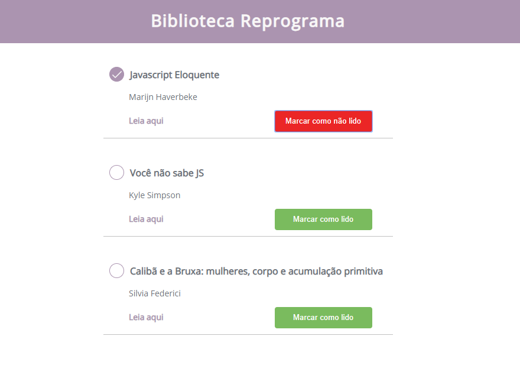

# Exercicio Casa

Esse é um exercício casa, para você treinar tudo o que aprendemos em aula. Aqui você vai colocar em prática, métodos como função, variáveis e condicionais. 

O arquivo de estrutura HTML e CSS, já estão disponíveis e montadas para que você não perca tempo na confecção da página, a sua missão vai ser realizar a interação desse checklist com javascript.

## Passo a passo

O objetivo do exercício é o seguinte: você vai criar um checklist  com a lista de alguns livros que você deseja ler utilizando apenas o DOM.
Em cada item da lista deve ser possível, marcar e desmarcar com lido, quando clicar no botão.
Use a imagem acima como referência, para montar a estrutura. 

### Primeiro

No arquivo HTML, já disponível e estruturado para você, a sua missão vai ser primeiramente linkar  as tags do html ao javascript.

### Segunda 

No arquivo javascript, você vai estruturar todo o código. 
Vou deixar você pensar um pouquinho.  
